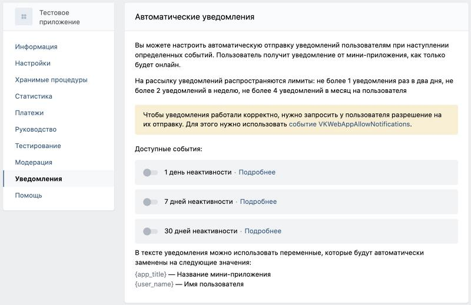
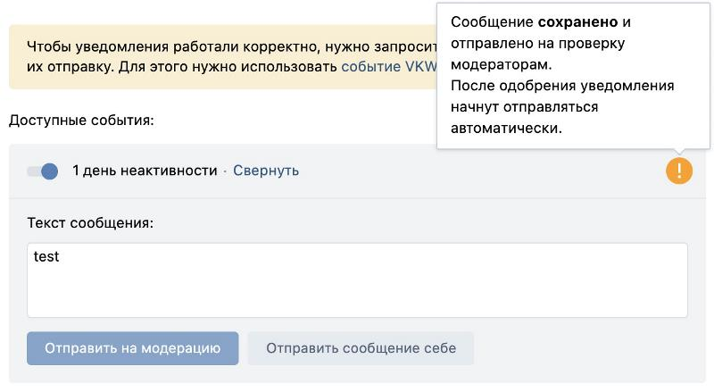

# Работа с уведомлениями

Привлекайте в мини-приложение своих постоянных пользователей или возвращайте неактивных с помощью уведомлений.
Пользователь получит push-уведомление и оповещение в колокольчик.

Для отправки уведомлений пользователь должен разрешить их явным образом, вызвав событие `VKWebAppAllowNotifications` или выбрав соответствующий пункт в сервисном меню клиента.


Уведомления бывают:

* разовые (ситуативные, привязанные к любым событиям в сервисе);
* автоматические (привязанные к дням неактивности пользователей);
* массовые (рассылка активным пользователям в честь какого-то события).

**Важно!** Включить уведомления можно только после публикации в каталоге.

## Разовые уведомления

После того как пользователь разрешил отправку уведомлений из вашего мини-приложения, вы можете записать полученный из параметров запуска мини-приложения
или ответа на событие `VKWebAppAllowNotifications` идентификатор пользователя в свою базу рассылки.

Важно! Пользователь может управлять уведомлениями из настроек официального приложения — поэтому важно проверять возможность отправки,
даже если он не отключал или не включал уведомления напрямую из вашего мини-приложения. Используйте для этого метод `apps.isNotificationsAllowed` с сервисным ключом доступа приложения.

Для отправки уведомлений используйте метод `notifications.sendMessage` с сервисным ключом доступа приложения.

Если в вашем мини-приложении реализована навигация по хешу, вы можете перенаправлять пользователя прямо из уведомления при помощи параметра метода `notifications.sendMessage fragment`.

Параметр `fragment`  —  содержимое хеша (часть URL в ссылке на приложение вида `http://vk.com/app123456#fragment`). Он вернётся вместе с параметрами запуска после символа #.

Для удобства тестирования количество уведомлений, отправленных руководителям приложения, не ограничено.

### Лимиты

Нельзя отправлять более одного уведомления в календарные сутки (по GMT+3).

```
Этот лимит может быть увеличен в индивидуальном порядке для приложений, размещённых в каталоге, при условии,
что пользователь явным образом соглашается на получение уведомлений сверх лимита и имеет возможность настройки точного времени или периодичности их получения.
```

## Автоматические уведомления

Вы можете настроить автоматическую отправку уведомлений пользователям, если они не запускали ваше мини-приложение в течение 1, 7 или 30 дней. Пользователь получит уведомление от мини-приложения, как только будет онлайн.

Как включить

1. Откройте **Мои приложения → Редактировать → Уведомления**.
2. В блоке **Автоматические уведомления** нажмите **Подробнее** напротив подходящего события и введите текст сообщения, которое увидят пользователи в уведомлении. Нажмите **Отправить сообщение** себе,
   чтобы посмотреть, как уведомление будет выглядеть у пользователя.
3. Чтобы отправить сообщение на проверку, нажмите **Отправить на модерацию**.

    

Как только вашу заявку одобрит модерация, вы получите сообщение об этом и сможете включить рассылку уведомлений.
Если хотите, чтобы уведомления начали отправляться сразу после прохождения модерации, переключите тумблер напротив события ещё до одобрения заявки.

  

### Лимиты

Пользователь получит не более 1 уведомления раз в два дня, не более 2 уведомлений в неделю, не более 4 уведомлений в месяц.


## Массовые рассылки

Чтобы привлечь активных пользователей к какому-либо событию в мини-приложении, запустите массовую рассылку уведомлений.

Как включить

1. Откройте **Мои приложения → Редактировать → Уведомления**.
2. В блоке **Массовые рассылки** нажмите **Создать рассылку**.
3. Придумайте название для рассылки и нажмите **Добавить**.
4. Укажите период, в который будет работать рассылка: даты и время.

    

5. Введите текст сообщения, которое увидят пользователи в уведомлении. Нажмите **Отправить сообщение себе**, чтобы посмотреть, как уведомление будет выглядеть у пользователя.
6. Нажмите **Отправить на модерацию**, чтобы сообщение ушло на проверку.

Как только ваша заявка будет одобрена модерацией, вы получите оповещение в личные сообщения и сможете включить рассылку уведомлений.
Если вы хотите, чтобы уведомления начали отправляться сразу после прохождения модерации, переключите тумблер напротив события ещё до одобрения заявки.

### Лимиты

Массовые уведомления рассылаются не чаще одного раза в 3 месяца.

## Разрешение и отключение уведомлений

Пользователь может разрешить мини-приложению отправку уведомлений двумя способами:

* Включив уведомления, из вызванного событием `VKWebAppAllowNotifications` всплывающего окна.
  В этом случае на клиент вернется событие с типом `VKWebAppAllowNotificationsResult`.
* Открыв системное меню (три точки справа) внутри мини-приложения и включив уведомления оттуда. В таком случае в приложение придёт событие из пункта выше. (Платформы: iOS, Android)

Запрет на отправку уведомлений может быть выдан вызовом события `VKWebAppDenyNotifications` в вашем мини-приложении и из системного меню приложения соответственно.

Информация о статусе подключения уведомлений передается при запуске приложения в параметре запуска `vk_are_notifications_enabled`, чтобы вы могли сразу показать нужную кнопку для включения или выключения уведомлений в мини-приложении.

```
**Рекомендации**.  Как составить эффективное уведомление, которое не отпугнёт пользователя.
```